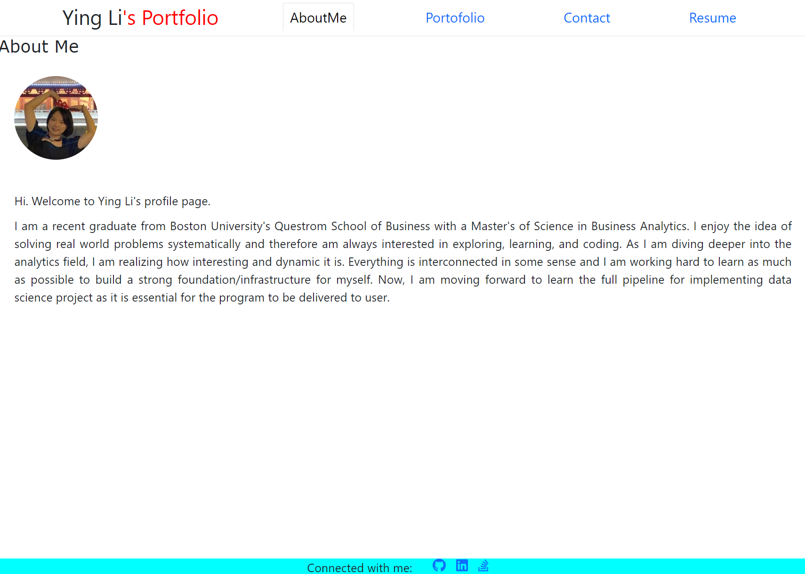
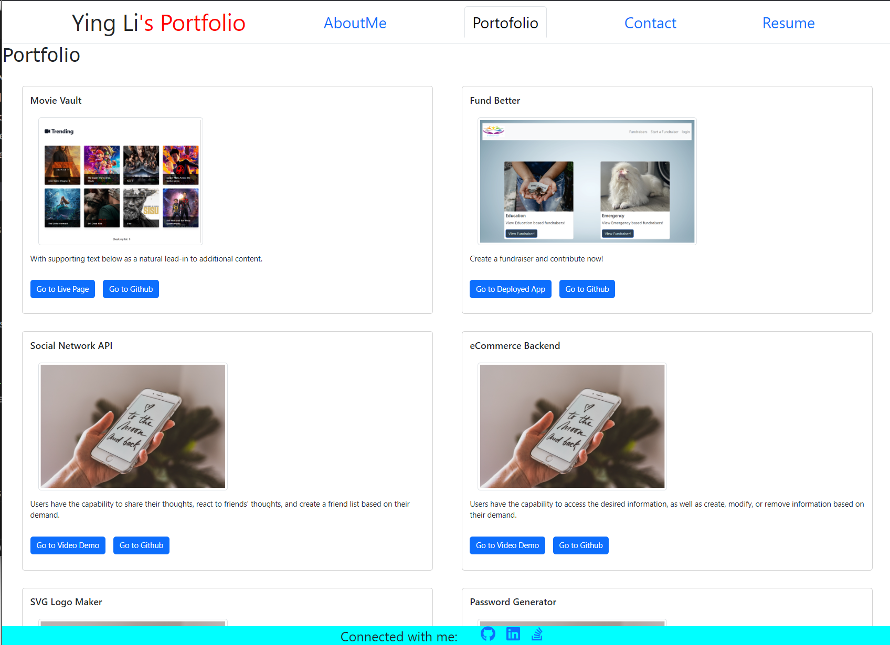
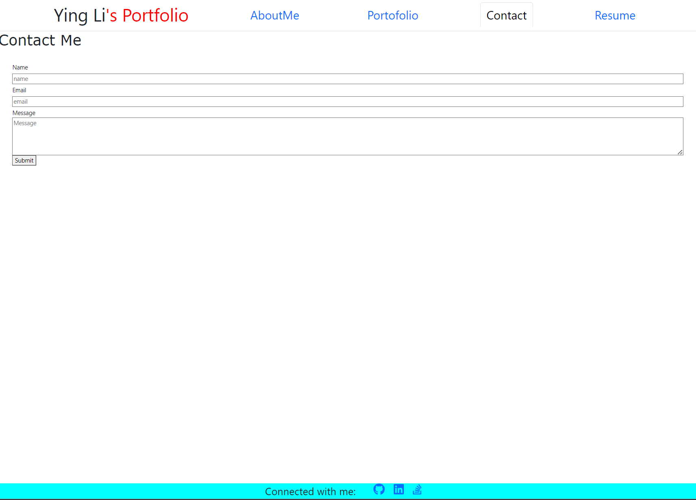
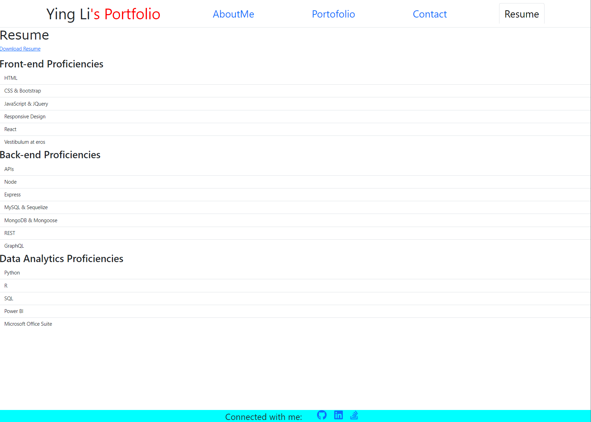

# react-portfolio


App Deployment Link: https://yul402.github.io/react-portfolio/

## Description

In this project, a single-page react application portfolio containing "AboutMe", "Portfolio", "Contact" and "Resume" tabs are built to showcase personal skillsets.

## Table of Contents

* [Installation](#Installation)

* [Technology](#technology)

* [Usage](#usage)

* [License](#license)

* [Contributing](#contributing)

* [Tests](#tests)

* [Questions](#questions)


## Installation

To install dependencies, run these commands:

```
npm install
```

## Technology
Technology used:
- React
- Bootstrap

## Usage
- Basic personal background information is shown in "AboutMe" tab.



- Projects are demonstrated in portfolio page. User can either "Go to Live Page" or "Go to Github" for a specific project.



- In contact page, portfolio viewer can contact portfolio owner by filling and submitting the form.



- In resume page, skillsets are listed and resume can be downloaded here.



## License

      Copyright © MIT. All rights reserved. 
      
      Licensed under the MIT license.


## Contributing
To make this project better, please fork the repo and create a pull request. You can also simply open an issue with the tag "enhancement".

* Fork the Project
* Create your Feature Branch (git checkout -b feature/AmazingFeature)
* Commit your Changes (git commit -m 'Add some AmazingFeature')
* Push to the Branch (git push origin feature/AmazingFeature)
* Open a Pull Request

## Tests

To run tests, run these commands:

```
npm run test
```

## Questions
This project is contributed by [yul402](https://github.com/yul402/)

Contact infotmation: Ying.li20@outlook.com
